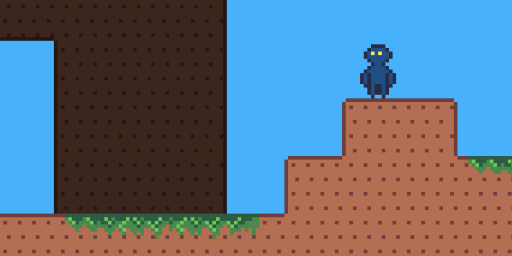

# gamejam basecode

html5 game framework + platformer sample written in typescript. uses parcel, pixijs, miniplex.

### features

- entity component system architecture courtesy of [miniplex](https://github.com/hmans/miniplex)
- aseprite animations
- ldtk world support, to some degree
- basic arcade-y physics
  - currently makes a lot of platformer-specific assumptions
- some a\* pathing which I haven't adapted to platforming yet
- probably lotta bugs

### good to know for when I forget

- ldtk world in src/asset/world/world.json
  - use 'Block' enum for map collisions
  - `Animation` enum for animated tiles
  - tile layers named `Background`, `Base`, `Foreground` have hard coded z-indexes and tints
  - `Background` layer doesn't generate collisions
- required character animations (with `character_animator`):
  - `idle`, `run`, `jump`, `fall`
- canvas is scaled to window height (`98vh` in css)
- resolution set in src/game/base.ts, `initPixi()`
- ??
- go ham
